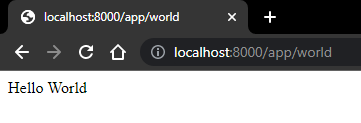
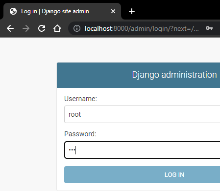
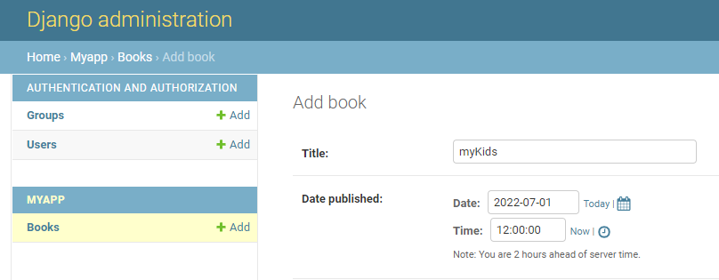
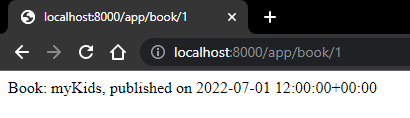
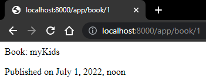

# Eigene Technologie - Django (Python Framework)

## Was ist Django

Django ist ein Web-Framework für Python, welches einen Clean-Code Ansatz verfolgt (DRY-Prinzip - Don’t repeat yourself).
Bereits seit 2005 wird an Django entwickelt und die letzte offizielle Version ist 4.0.5.

*(https://www.djangoproject.com/, https://github.com/django/django, https://github.com/django, https://docs.djangoproject.com/en/4.0/, https://de.wikipedia.org/wiki/Django_(Framework))*

### Zentrale Konzepte
 - Django nutzt sogennante Apps, welche kleine Einheiten (Units oder Teile) eines Projektes abbilden (ähnlich einem Modul oder Package - Modularisierung)
    - ein App beinhaltet zB Models, URLs, Views und Templates
    - innerhalb einer Applikation werden alle Apps in einer Konfigurationdatei registriert/definiert

 - Views sind grundsätzlich Funktionen welche für Logiken verantwortlich (ähnlich einem Controller nach MVC)
    - einer URL ist ein View zugrordnet, welcher für Backendlogik zuständig ist
    - ein View liefert dann Daten an eine Seite - meist in Form eines HTML-Templates oder per JSON-Daten
    - können auch durch Klassen representiert werden - man spricht von **Class based Views**
    - **Class based Views** erweitern **Function based Views** - zweitere sind aber einfacher zu verstehen und besser dokumentiert

 - Routing mittels URL-Patterns
    - ein **urlpattern** fasst mehrere Pfade (**path**) zusammen
    - ein Pfad wird mit einem View verknüpft

 - Django verfügt über eine eigene Template Language (Engine)
    - auch mittels Jinja2 konfigurierbar (Python Template-Engine)
 - eigenes Django REST Framework für die Unterstützung einer REST-API

 - Ünterstützung der Anbindung an verschiedene Datenbanksysteme
    - standardmäßig wird ein SQLite Datenbank mitgeliefert
    - nichtsdestotrotz können problemlos andere Datenbanken angebunden werden (zB MySQL)
 - Migrations
 - Models repräsentieren (wie nach dem MVC-Pattern) Domänen (DDD) bzw. Entities (Datenbankmodelle - Model entspricht Entity)
    - 1:1, 1:n und n:m Beziehungen können vierbei festgelegt werden
 - Django ORM (Object-Relational Mapping)

 - CRUD-Funktionalitäten
    - können selbstständig ausprogrammiert werden
    - **Model Forms** und **Class based Views** können aber viele dieser Funktionen übernehmen
 - Static Files
    - entahlen visuelle Teile die für die Anzeige benötigt werden (zB CSS, JS, Bilder)
    - können zentral konfiguriert werden
 - Authentifizierung
    - bietet eine Out-of-the-Box Lösung für alle wichtigen Funktionen: Register, Login, Logout, Reset Password

 - Admin Panel
    - ist eine vordefinierte Ansicht (Quick-Start Interface)
    - unterstützt den Entwickler bei der Datenbank-Verwaltung
 - Django Commands
 - Signals
    - werden benötigt, um Events "abzuhören" - Event gerieben mittels Sender und Receiver
 - Deployment
    - unter anderem möglich mit Heroku, AWS, Linode (Cloud-Hosting)

## Django vs. Laravel

Sowohl Django als auch Laravel sind beides Frameworks, die die Webentwicklung erleichtern. Neben der zu Grunde liegenden Programmiersprache, gibt noch einige weitere Unterschiede, aber auch Gemeinsamkeiten.

### Unterschiede

 - Django basiert auf Python - Laravel auf PHP

 - Django verfolgt MVT (Model View Template) - Laravel verfolgt strikt MVC (Model View Contoller)
    - lässt sich aber gut in Relation setzten
        - Model - Model (minimale Differenzen)
        - View - Controller (hier entsteht der größte Unterschied)
        - Template - View (in diesem Fall eigentlich exakt das selbe)
 - Django hat keine built-in REST-API - Laravel schon
    - Django stellt diese aber durch ein eigenes Django REST Framework (DRF) zur Verfügung
 - Django unterstützt NoSQL Technologien - Laravel standardmäßig nicht (aber mittels Third-Party-Packages möglich)
 - Für Test kann unter Django zB Pythons "unitest" Framework verwendet werden - Laravel nutzt zwei Testebenen: Unit und Festure Tests

 - Django unterstützt Microservicearchitektur - Laravel grundsätzlich nicht
    - Django: durch Apps, aber auch Event-driven durch Signals
    - Laravel: mittels Lumen aber gut möglich *(https://lumen.laravel.com/docs/9.x)*
 - Django ist grundsätzlich auf eine höheren Sicherheitslevel wie Laravel (zB Cross-Site-Scripting)
 - Django bietet eine geringere Flexibilität wie Laravel
 - Django erscheint etwas komplexer als Laravel, welches simpler aufgebaut und dadurch etwas leserlicher ist
 - Django ist grundsätzlich etwas performanter

### Gemeinsamkeiten bzw. Ähnlichkeiten
 - beide sind Open-Source
 - eigene Template Engine (Django Template Language - Laravel Blade)
 - Migrations
 - weite Datenbankunterstützung
 - **Django Auth.** ähnlich zu **Laravel Breeze**
    - Out-of-the-Box Lösung
    - einfach einzubinden
    - Middleware
 - Static Files ähnlich den Public Files
 - eigene **Django Commands** ähneln den **Laravel artisan Commands**
 - hohe Skalierbarkeit

Gundsätzlich lässt sich also sagen, dass beide Webframeworks in fast allen Bereichen verwendet werden können. Django ist vor allem eine gute Wahl im Bereich Machine Learning und bei sicherheitsabhängigen Applikationen, kann aber auch kleinen Projekten schnell zu unnötiger Komplexität führen. Laravel ist etwas einsteigerfreundlicher und für einfache, schnelle Webapps eher geeignet.

## Einfache Applikation - schneller Einstieg in Django

Viele zentrale Konzepte des Frameworks können mit diesem Minimalbeispiel in schon 30 Minuten erarbeitet werden, um einen Einblick in das Programmieren mit Django zu bekommen.

*Umgestetzt auf einer virtuellen Umgebung mittels Docker (inkl. Compose) und mit einer MySQL-Datenbank (standardmäßig wird SQLite mitgeliefert, was auch verwendet werden kann)*

### Vorraussetzungen
 - Docker
 - Docker Compose

### Installation

Einrichtung des Docker-Django Projekts: https://docs.docker.com/samples/django/

Dockerfile:
```Dockerfile
#syntax=docker/dockerfile:1
FROM python:3
ENV PYTHONDONTWRITEBYTECODE=1
ENV PYTHONUNBUFFERED=1
WORKDIR /code
COPY requirements.txt /code/
RUN pip install -r requirements.txt
COPY . /code/
```

requirements.txt:

```txt
Django>=3.0,<4.0
mysqlclient==2.1.1
django-mysql==4.7.0
```

Docker-Compose:
```yml
version: "3"
   
services:
  db:
    image: mysql:8
    ports:
      - "3306:3306"
    environment:
      - MYSQL_DATABASE=firstapp
      - MYSQL_ROOT_PASSWORD=123
  web:
    build: .
    command: python manage.py runserver 0.0.0.0:8000
    volumes:
      - .:/code
    ports:
      - "8000:8000"
    depends_on:
      - db
  adminer:
    image: adminer
    ports:
      - 8080:8080
```

Ablauf:
```bash
sudo docker-compose run web django-admin startproject composeexample . #erstellen eines Django-Projekts
sudo chown -R $USER:$USER composeexample manage.py #rechte vergeben
docker-compose up #Container starten
docker exec -it <CONTAINER-ID> /bin/bash #um in den Container zu springen
```

Datenbankanbindung:

```py
#settings.py

#...

DATABASES = {
    'default': {
        'ENGINE': 'django.db.backends.mysql', 
        'NAME': 'firstapp',
        'USER': 'root',
        'PASSWORD': '123',
        'HOST': 'db', #10.77.0.115
        'PORT': '3306',
    }
}
```

### Grundlagen

```bash
#App erstellen
python manage.py startapp myapp

#Migrate
python manage.py migrate

#Rechte vergabe für App-Directory falls nötig
sudo chown -R admin myapp/
```

Defnieren einer Route auf zu unserem App, in der dann App-spezifische Routen definiert werden

```py
#firstapp/urls.py

from django.contrib import admin
from django.urls import path, include

from python.django.docker import myapp

urlpatterns = [
    path('app/', include('myapp.urls')),
    path('admin/', admin.site.urls),
]
```

```py
#myapp/urls.py

from django.urls import path
from . import views

urlpatterns = [
    path('world', views.index, name='index')
]
```

Funktion-View defnieren, der schlussendlich auf die Route 'app/world' anspringt 

```py
#myapp/views.py
from django.shortcuts import render
from django.http import HttpResponse

def index(request):
    return HttpResponse("Hello World")
```

App registrieren, um untern anderem die Datenbank verwenden zu können

```py
#firstapp/settings.py

#...

INSTALLED_APPS = [
    'myapp.apps.MyappConfig'
    #...
]
```

Model erstellen

```py
#myapp/models.py

from django.db import models

class Book(models.Model):
    title = models.CharField(max_length=200)
    pub_date = models.DateTimeField('date published')
```

Damit das Model und damit auch das Entity in der Datenbank im Admin-Panel gemanaged werden kann, muss es registriert werden
```py
#myapp/admin.py

from django.contrib import admin

from .models import Book
admin.site.register(Book)
```



Migration für unsere App erstellen

```bash
#Migration erstellen
python manage.py makemigrations
   #Migration-Number wird ausgegeben

#Änderungen übernehmen
python manage.py sqlmigrate myapp 0001 #hier Migration-Number verwenden

#Schlussendlich migrieren
python manage.py migrate myapp
```

Um nun über das Admin-Panel auf die Tabelle zugreifen zu können, muss noch ein sogenannter "superuser" erstellt werden (um sich auch einloggen zu können). Es muss ein Name, eine E-Mail-Adresse und ein Passwort angegeben werden.

```bash
python manage.py createsuperuser #name = root | password = 123
```



Die Oberfläche stellt nun ein minimales Datenbank-Verwaltungstool zu Verfügung.



Nun kann eine einfache get-Funktion implementiert werden

```py
#myapp/urls.py
from django.urls import path
from . import views

urlpatterns = [
    #...
    path('book/<int:book_id>', views.book_by_id, name='book_by_id'),
]

#myapp/views.py

from django.http import HttpResponse
from .models import Book

#...

def book_by_id(request, book_id):
    book = Book.objects.get(pk=book_id)
    return HttpResponse(f"Book: {book.title}, published on {book.pub_date}")
```



Natürlich sollte ein Template für die Anzeige zuständig sein

```html
<!-- myapp/templates/book_details.py -->
<p>Book: {{ book.title }}</p>
<p>Published on{{ book.pub_date }}</p>
```

Die Template muss aus dem View gerendert werden - ihr wird das Book-Objekt übergeben

```py
#myapp/views.py
from django.shortcuts import render
from .models import Book

#...

def book_by_id(request, book_id):
    book = Book.objects.get(pk=book_id)
    return render(request, 'book_details.html', {'book' :book})
```



# Quellen
 - https://www.djangoproject.com/
 - https://github.com/django/django
 - https://github.com/django
 - https://docs.djangoproject.com/en/4.0/
 - https://www.youtube.com/watch?v=0sMtoedWaf0&list=WL&index=10&ab_channel=DennisIvy
 - https://www.youtube.com/watch?v=OsbywnANIec&ab_channel=GKTechFlex
 - https://www.youtube.com/watch?v=ZsJRXS_vrw0&list=WL&index=11&ab_channel=IDGTECHtalk

Docker:
 - https://roytuts.com/docker-compose-dockerizing-django-mysql-app/#comments
 - https://dev.to/foadlind/dockerizing-a-django-mysql-project-g4m
 - https://docs.docker.com/samples/django/
 - https://hub.docker.com/_/mysql
 - https://pypi.org/project/mysqlclient/
 - https://stackoverflow.com/questions/19189813/setting-django-up-to-use-mysql
 - https://dev.mysql.com/doc/connector-python/en/connector-python-django-backend.html
 - https://docs.djangoproject.com/en/3.2/ref/settings/#databases

Tutorial:
 - https://www.youtube.com/watch?v=ZsJRXS_vrw0

